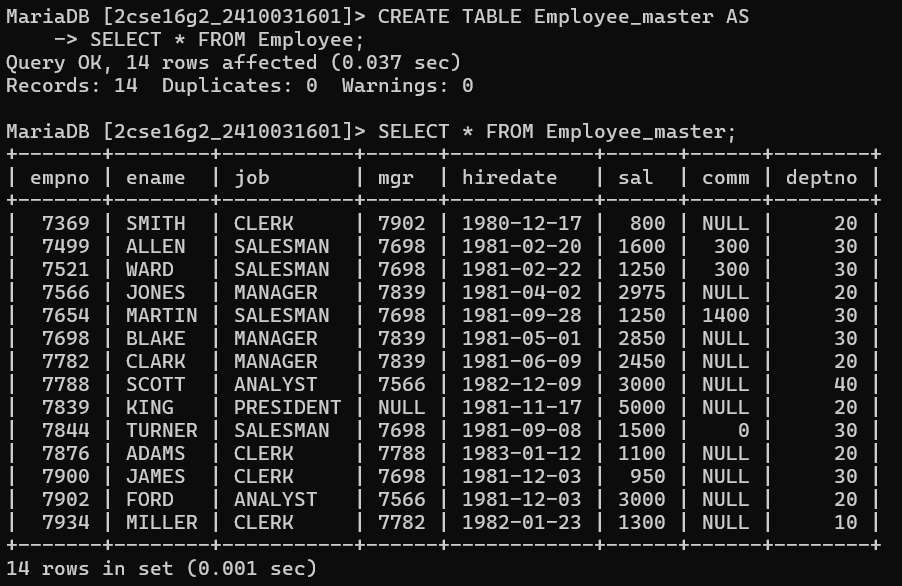
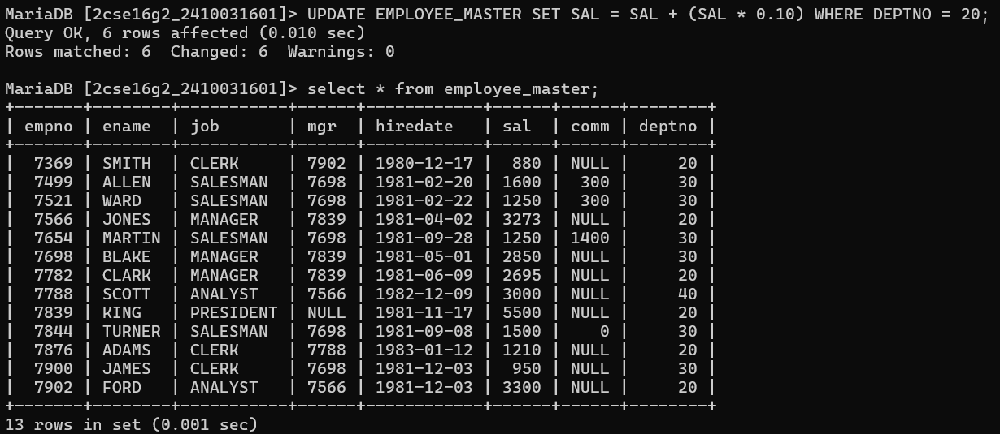
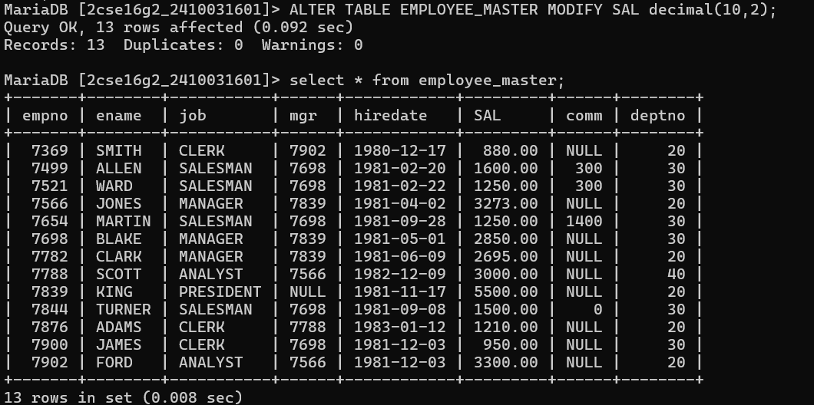
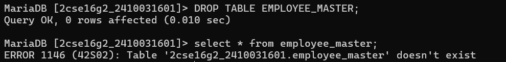

# Question 1 Create `Employee_master` table with data using `Employee` table.
#Query
CREATE TABLE Employee_master AS
SELECT * FROM Employee;

#question 2 - Delete all record into Employee_master whose DeptNo is 10
#query - DELETE FROM employee_master
WHERE deptno = 10;

#question 3:- Update 10% in his salary of DEPTNO 20 into Employee_Master. 
#query:-
UPDATE EMPLOYEE_MASTER SET SAL = SAL + (SAL * 0.10)
WHERE DEPTNO = 20;

#question 4:-Alter SAL with size 10,2 in Employee_Master.
#query:-
ALTER TABLE EMPLOYEE_MASTER 
MODIFY SAL NUMBER(10,2);

#question 5:- Drop Employee_master Table.
#query:-
DROP TABLE Employee_master;

