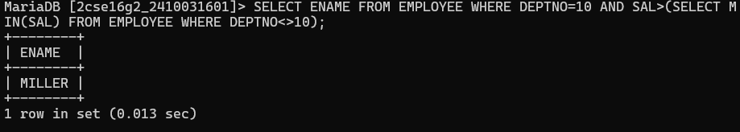
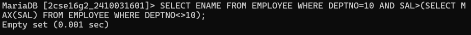
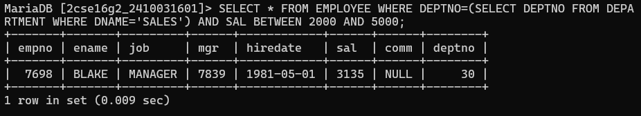
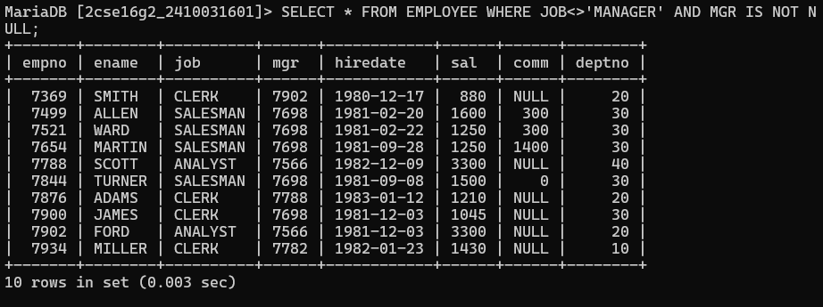
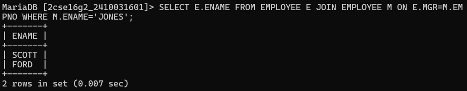
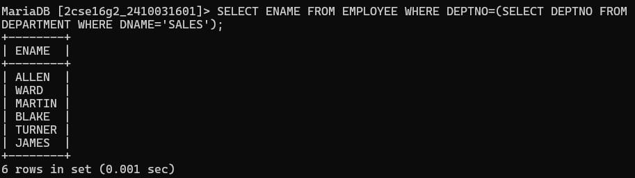
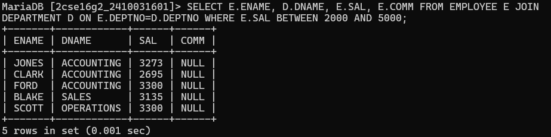
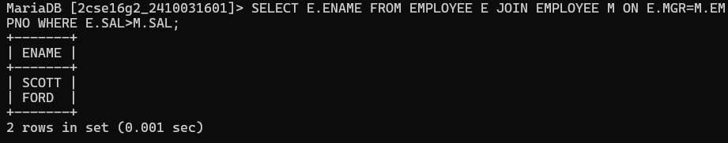
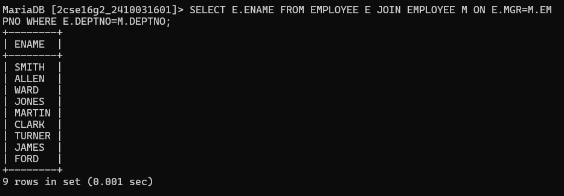

# question 1. Display the names of employees from department number 10 with salary greater than that of any employee working in other departments. 
# quesry :-SELECT ENAME FROM EMPLOYEE WHERE DEPTNO=10 AND SAL>(SELECT MIN(SAL) FROM EMPLOYEE WHERE DEPTNO<>10);

# question 2. Display the names of employee from department number 10 with salary greater than that of all employee working in other departments. 
# quesry :-SELECT ENAME FROM EMPLOYEE WHERE DEPTNO=10 AND SAL>(SELECT MAX(SAL) FROM EMPLOYEE WHERE DEPTNO<>10);

# question 3. Display the details of employees who are in sales dept and grade is 3. 
# quesry :-SELECT * FROM EMPLOYEE WHERE DEPTNO=(SELECT DEPTNO FROM DEPARTMENT WHERE DNAME='SALES') AND SAL BETWEEN 2000 AND 5000;

# question 4. Display those who are not managers and who are managers anyone. 
# quesry :-SELECT * FROM EMPLOYEE WHERE JOB<>'MANAGER' AND MGR IS NOT NULL;

# question 5. Display those employees whose manager name is jones. 
# quesry :-SELECT E.ENAME FROM EMPLOYEE E JOIN EMPLOYEE M ON E.MGR=M.EMPNO WHERE M.ENAME='JONES';

# question 6. Display ename who are working in sales dept. 
# quesry :-SELECT ENAME FROM EMPLOYEE WHERE DEPTNO=(SELECT DEPTNO FROM DEPARTMENT WHERE DNAME='SALES');

# question 7. Display employee name, deptname, salary and comm. For those sal in between 2000 to 5000 while location is chicago. 
# quesry :-SELECT E.ENAME, D.DNAME, E.SAL, E.COMM FROM EMPLOYEE E JOIN DEPARTMENT D ON E.DEPTNO=D.DEPTNO WHERE E.SAL BETWEEN 2000 AND 5000;

# question 8. Display those employees whose salary greater than his manager salary. 
# quesry :-SELECT E.ENAME FROM EMPLOYEE E JOIN EMPLOYEE M ON E.MGR=M.EMPNO WHERE E.SAL>M.SAL;

# question 9. Display those employees who are working in the same dept where his manager is working. 
# quesry :-SELECT E.ENAME FROM EMPLOYEE E JOIN EMPLOYEE M ON E.MGR=M.EMPNO WHERE E.DEPTNO=M.DEPTNO;

# question 10. Display grade and employees name for the dept no 10 or 30 but grade is not 4, while joined the company before 31-dec-82.
# quesry :-SELECT S.GRADE, E.ENAME FROM EMPLOYEE E JOIN SALGRADE S ON E.SAL BETWEEN S.LOSAL AND S.HISAL WHERE E.DEPTNO IN (10,30) AND S.GRADE<>4 AND E.HIREDATE<'1982-12-31';
salgrade table required for 10th query 