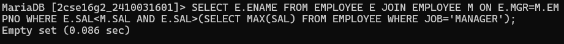
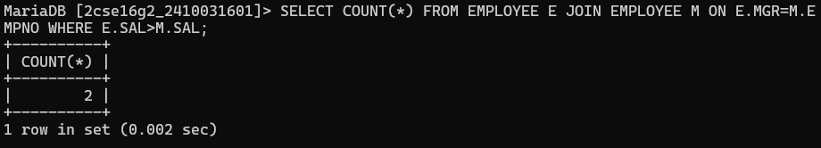
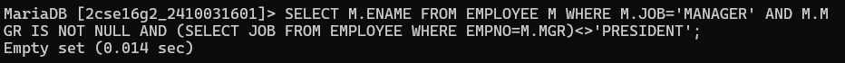
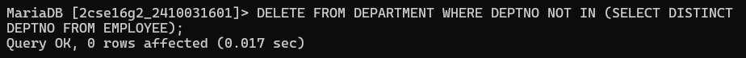
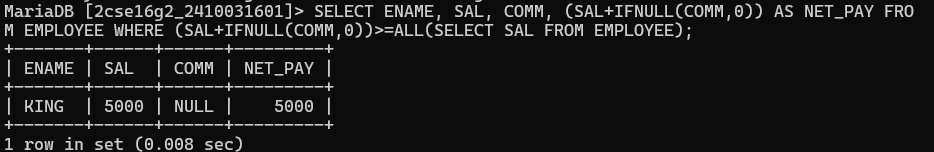
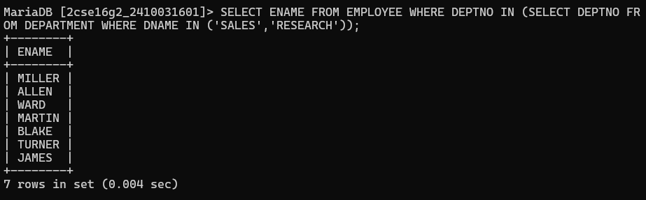
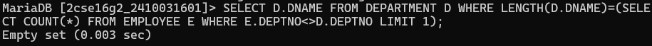

# question 1. Display those employees whose salary is less than his manager but more than salary of any other managers. 
# query :-SELECT E.ENAME FROM EMPLOYEE E JOIN EMPLOYEE M ON E.MGR=M.EMPNO WHERE E.SAL<M.SAL AND E.SAL>(SELECT MAX(SAL) FROM EMPLOYEE WHERE JOB='MANAGER');

# question 2. Find out the number of employees whose salary is greater than their manager salary? 
# query :-SELECT COUNT(*) FROM EMPLOYEE E JOIN EMPLOYEE M ON E.MGR=M.EMPNO WHERE E.SAL>M.SAL;

# question 3. Display those managers who are not working under president but they are working under any other manager? 
# query :-SELECT M.ENAME FROM EMPLOYEE M WHERE M.JOB='MANAGER' AND M.MGR IS NOT NULL AND (SELECT JOB FROM EMPLOYEE WHERE EMPNO=M.MGR)<>'PRESIDENT';

# question 4. Delete those department where no employee working? 
# query :-DELETE FROM DEPARTMENT WHERE DEPTNO NOT IN (SELECT DISTINCT DEPTNO FROM EMPLOYEE);

# question 5. Delete those records from emp table whose deptno not available in dept table? 
# query :-DELETE FROM EMPLOYEE WHERE DEPTNO NOT IN (SELECT DEPTNO FROM DEPARTMENT);

# question 6. Display those earners whose salary is out of the grade available in sal grade table? 
# query :- SALGRADE required

# question 7. Display employee name, sal, comm. And whose net pay is greater than any other in the company? 
# query :-SELECT ENAME, SAL, COMM, (SAL+IFNULL(COMM,0)) AS NET_PAY FROM EMPLOYEE WHERE (SAL+IFNULL(COMM,0))>=ALL(SELECT SAL FROM EMPLOYEE);

# question 8. Display those employees who are working in sales or research? 
# query :-SELECT ENAME FROM EMPLOYEE WHERE DEPTNO IN (SELECT DEPTNO FROM DEPARTMENT WHERE DNAME IN ('SALES','RESEARCH'));

# question 9. Display the grade of jones? 
# query :-salgrade reduired

# question 10. Display the department name the no of characters of which is equal to no of employees in any other department? 
# query :-SELECT D.DNAME FROM DEPARTMENT D WHERE LENGTH(D.DNAME)=(SELECT COUNT(*) FROM EMPLOYEE E WHERE E.DEPTNO<>D.DEPTNO LIMIT 1);
