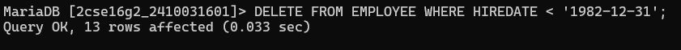
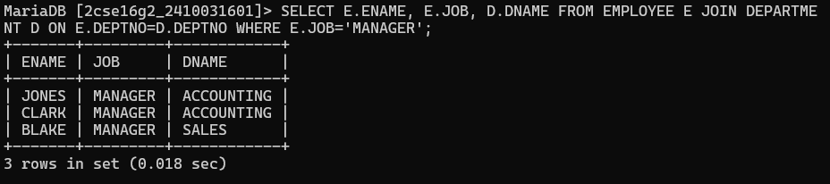
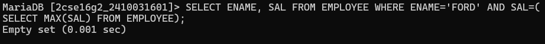
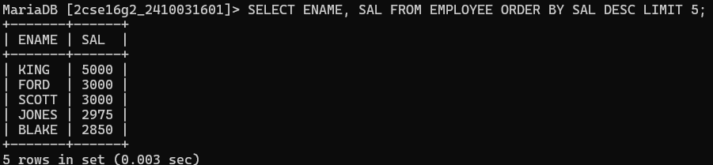
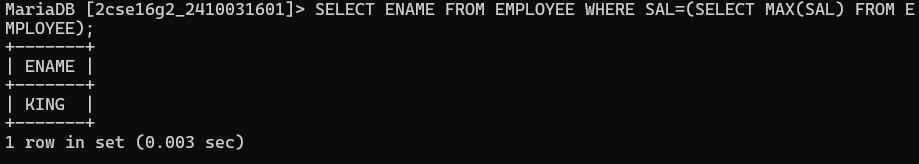
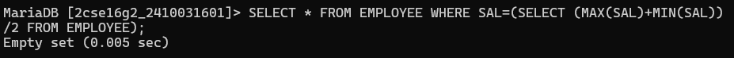
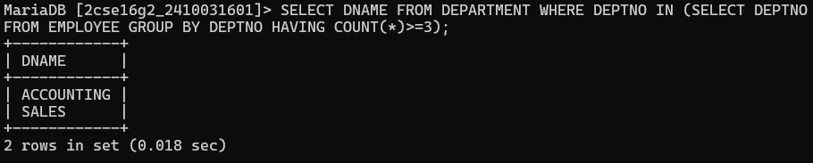
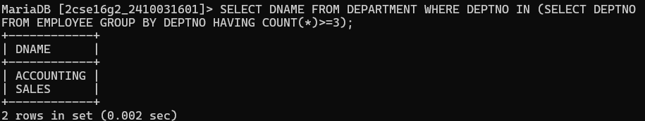
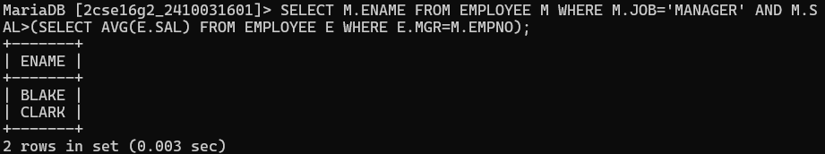
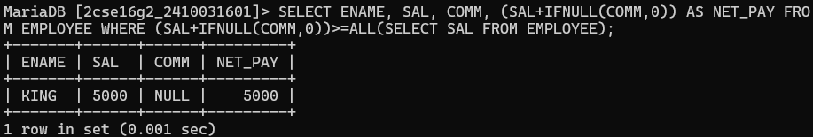

# question 1. Delete those employees who joined the company before 31 dec-82 while there dept location is‘new york’ or ‘chicago’.
# query :-DELETE FROM EMPLOYEE WHERE HIREDATE < '1982-12-31';

# question 2. Display employee name, job, deptname, location for all who are working as managers. 
# query :-SELECT E.ENAME, E.JOB, D.DNAME FROM EMPLOYEE E JOIN DEPARTMENT D ON E.DEPTNO=D.DEPTNO WHERE E.JOB='MANAGER';

# question 3. Display name and salary of ford if his sal is equal to high sal of his grade. 
# query :-SELECT ENAME, SAL FROM EMPLOYEE WHERE ENAME='FORD' AND SAL=(SELECT MAX(SAL) FROM EMPLOYEE);

# question 4. Find out the top 5 earner of company. 
# query :-SELECT ENAME, SAL FROM EMPLOYEE ORDER BY SAL DESC LIMIT 5;

# question 5. Display the name of those employees who are getting highest salary.
# query :-SELECT ENAME FROM EMPLOYEE WHERE SAL=(SELECT MAX(SAL) FROM EMPLOYEE);

# question 6. Display those employees whose salary is equal to average of maximum and minimum.
# query :-SELECT * FROM EMPLOYEE WHERE SAL=(SELECT (MAX(SAL)+MIN(SAL))/2 FROM EMPLOYEE);

# question 7. Display dname where at least 3 are working and display only dname 
# query :-SELECT DNAME FROM DEPARTMENT WHERE DEPTNO IN (SELECT DEPTNO FROM EMPLOYEE GROUP BY DEPTNO HAVING COUNT(*)>=3);

# question 8. Display name of those managers names whose salary is more than average salary of company. 
# query :-SELECT DNAME FROM DEPARTMENT WHERE DEPTNO IN (SELECT DEPTNO FROM EMPLOYEE GROUP BY DEPTNO HAVING COUNT(*)>=3);

# question 9. Display those managers name whose salary is more than an average salary of his employees. 
# query :-SELECT M.ENAME FROM EMPLOYEE M WHERE M.JOB='MANAGER' AND M.SAL>(SELECT AVG(E.SAL) FROM EMPLOYEE E WHERE E.MGR=M.EMPNO);

# question 10. Display employee name, sal, comm and net pay for those employees whose net pay are greater than or equal to any other employee salary of the company? 
# query :-SELECT ENAME, SAL, COMM, (SAL+IFNULL(COMM,0)) AS NET_PAY FROM EMPLOYEE WHERE (SAL+IFNULL(COMM,0))>=ALL(SELECT SAL FROM EMPLOYEE);
