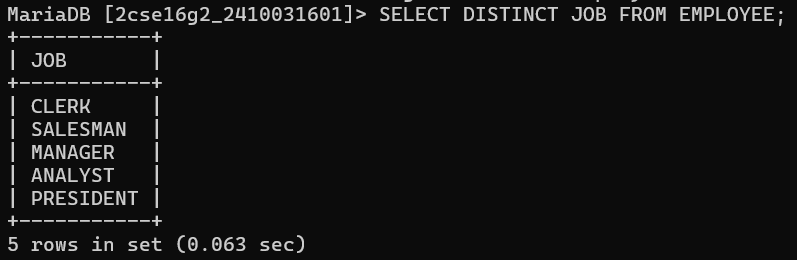
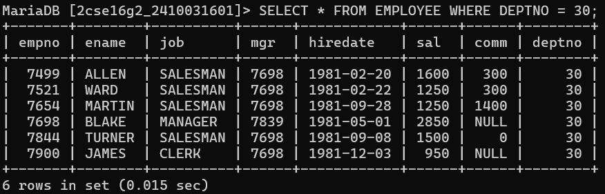
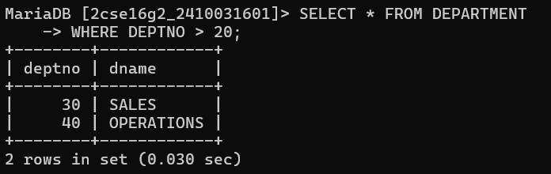
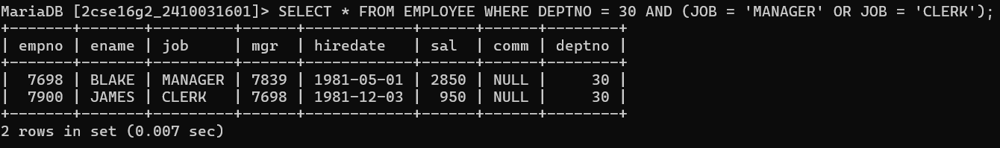
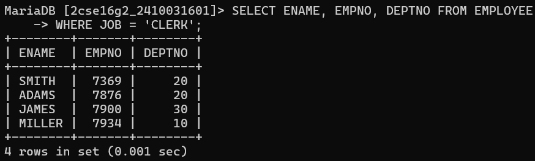
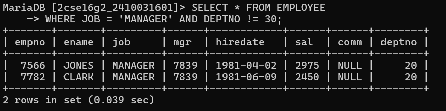
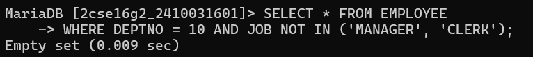
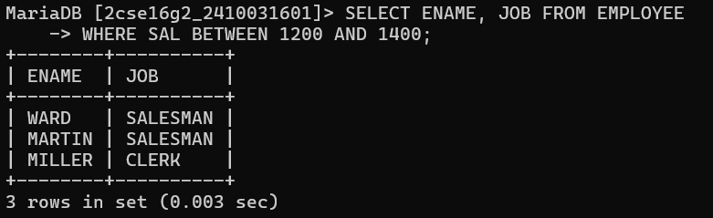
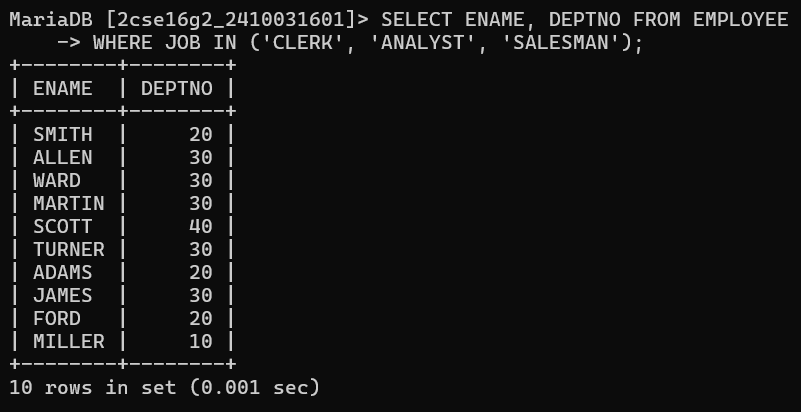
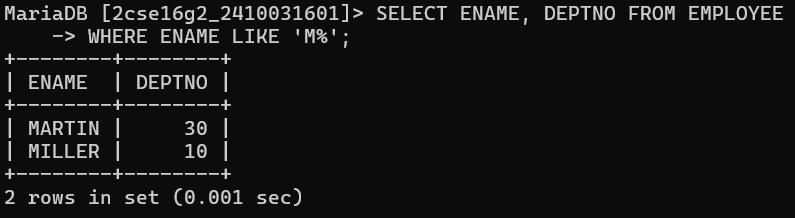

# question 1:- List all distinct job in Employee. 
# query:- SELECT DISTINCT JOB FROM EMPLOYEE;

# question 2:- List all information about employee in Department Number 30.
# query:-SELECT * FROM EMPLOYEE WHERE DEPTNO = 30;

# question 3:-Find all department numbers with department names greater than 20
# query:-SELECT * FROM DEPARTMENT WHERE DEPTNO > 20;

# question 4:- Find all information about managers and clerks in Department 30
# query :- SELECT * FROM EMPLOYEE WHERE DEPTNO = 30 AND (JOB = 'MANAGER' OR JOB = 'CLERK');

# question 5:-List employee name, employee number and department of all clerks.
# query:-SELECT ENAME, EMPNO, DEPTNO FROM EMPLOYEE WHERE JOB = 'CLERK';

 
 # question 6:-Find all managers not in Department 30
 # query:- SELECT * FROM EMPLOYEE WHERE JOB = 'MANAGER' AND DEPTNO != 30;

# question 7:-List employees in Department 10 who are not manager or clerks
# query:- SELECT * FROM EMPLOYEE WHERE DEPTNO = 10 AND JOB NOT IN ('MANAGER', 'CLERK');

# question 8:-Find employees and jobs earning between 1200 and 1400
# query:- SELECT ENAME, JOB FROM EMPLOYEE WHERE SAL BETWEEN 1200 AND 1400;

# question 9:-List name and department number of employees who are clerks, analyst or salesman
# query:- SELECT ENAME, DEPTNO FROM EMPLOYEE WHERE JOB IN ('CLERK', 'ANALYST', 'SALESMAN');

# question 10:- List name and department number of employees whose names begin with M
# query:- SELECT ENAME, DEPTNO FROM EMPLOYEE WHERE ENAME LIKE 'M%';

