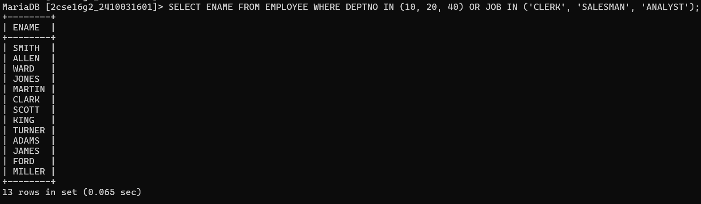
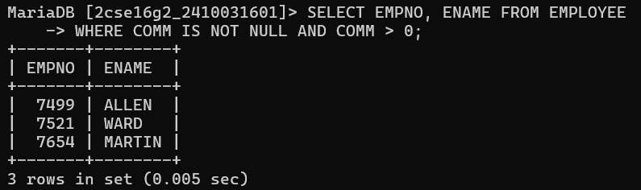
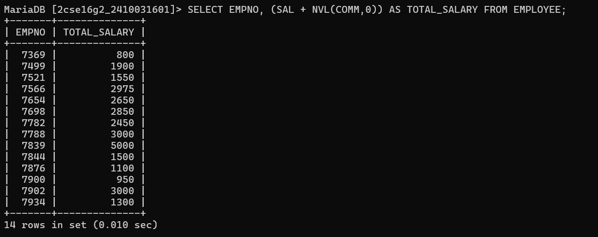
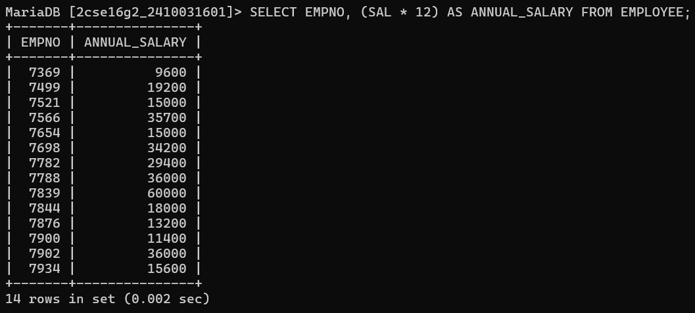
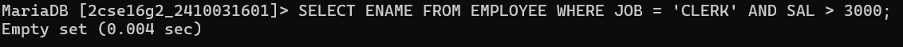
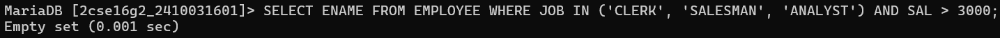

# question 1:- list all employees and jobs in Department 30 in descending order by salary
# query:- SELECT ENAME, JOB, SAL FROM EMPLOYEE WHERE DEPTNO = 30 ORDER BY SAL DESC;

# question 2:-List job and department number of employees whose name is five letters long, begins with 'A' and ends with 'N'
# query:-SELECT JOB, DEPTNO FROM EMPLOYEE WHERE ENAME LIKE 'A___N';

# question 3:-Display names of employees whose name starts with 'S'
# query :-SELECT ENAME FROM EMPLOYEE WHERE ENAME LIKE 'S%';

# question 4:-Display names of employees whose name ends with 'S'
# query :-SELECT ENAME FROM EMPLOYEE WHERE ENAME LIKE '%S';

# question 5:-Display names of employees working in department 10, 20, or 40 OR working as clerk, salesman or analyst
# query :-SELECT ENAME FROM EMPLOYEEWHERE DEPTNO IN (10, 20, 40) OR JOB IN ('CLERK', 'SALESMAN', 'ANALYST');

# question 6:-Display employee number and names for employees who earn commission
# query :-SELECT EMPNO, ENAME FROM EMPLOYEE WHERE COMM IS NOT NULL AND COMM > 0;

# question 7:-Display employee number and total salary for each employee
# query :-SELECT EMPNO, (SAL + NVL(COMM,0)) AS TOTAL_SALARY FROM EMPLOYEE;

# question 8:- Display employee number and annual salary for each employee
# query :-SELECT EMPNO, (SAL * 12) AS ANNUAL_SALARY FROM EMPLOYEE;

# question 9:- Display names of employees working as clerks and earning more than 3000
# query :-SELECT ENAME FROM EMPLOYEE WHERE JOB = 'CLERK' AND SAL > 3000;

# question 10:- Display names of employees who are clerk, salesman or analyst and earning more than 3000
# query :-SELECT ENAME FROM EMPLOYEE WHERE JOB IN ('CLERK', 'SALESMAN', 'ANALYST') AND SAL > 3000;
