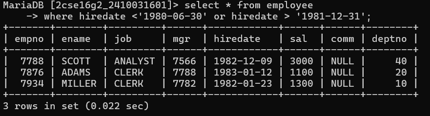
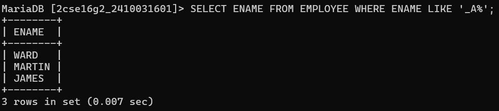
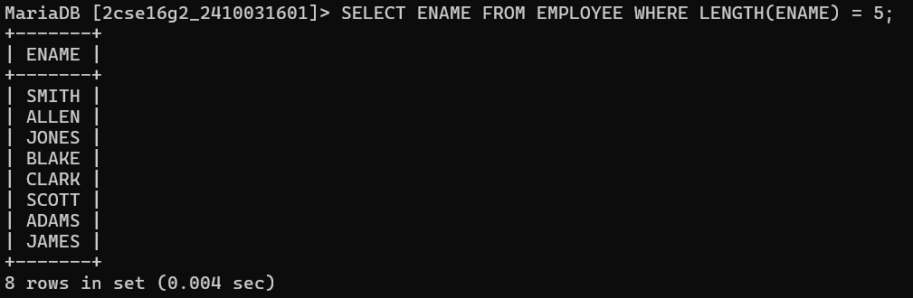
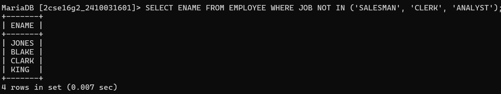
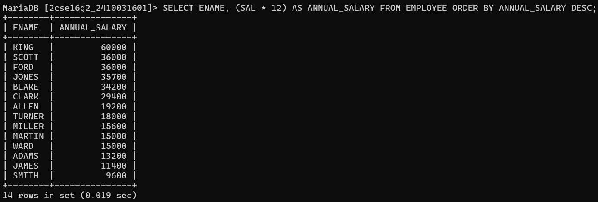
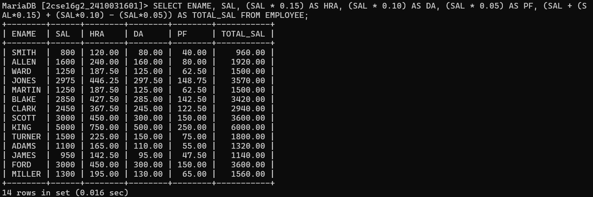
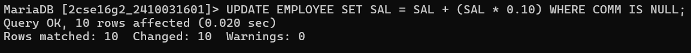
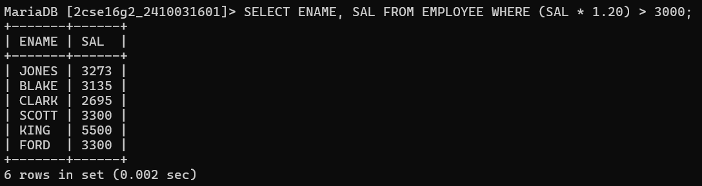
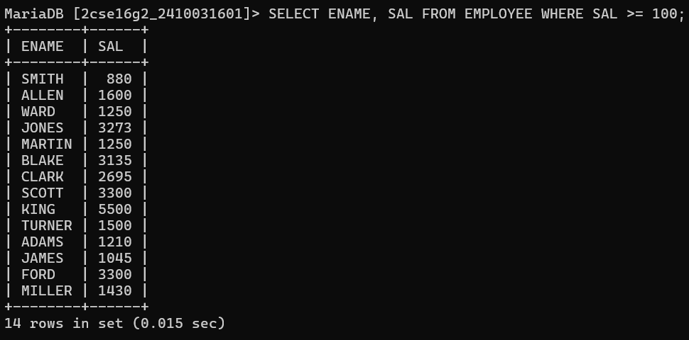

# question 1:-Display employees who joined before 30-June-1980 or after 31-Dec-1981
# query :-select * from employee where hiredate <'1980-06-30' or hiredate > '1981-12-31';

# question 2:-Display employees whose second letter is 'A'
# query :-SELECT ENAME FROM EMPLOYEE WHERE ENAME LIKE '_A%';

# question 3:-Display employees whose name is exactly 5 characters long
# query :-SELECT ENAME FROM EMPLOYEE WHERE LENGTH(ENAME) = 5;

# question 4:-Display employees who are NOT salesman, clerk, or analyst
# query :-SELECT ENAME FROM EMPLOYEE WHERE JOB NOT IN ('SALESMAN', 'CLERK', 'ANALYST');

# question 5:-Display employee name with annual salary, highest first
# query :-SELECT ENAME, (SAL * 12) AS ANNUAL_SALARY FROM EMPLOYEE ORDER BY ANNUAL_SALARY DESC;

# question 6:-Display name, sal, hra, da, pf, total salary
# query :-SELECT ENAME,
#       SAL,
#       (SAL * 0.15) AS HRA,
#      (SAL * 0.10) AS DA,
#       (SAL * 0.05) AS PF,
#       (SAL + (SAL*0.15) + (SAL*0.10) - (SAL*0.05)) AS TOTAL_SAL
# FROM EMPLOYEE;

# question 7:-Update salary by 10% for employees not getting commission
# query :-UPDATE EMPLOYEE SET SAL = SAL + (SAL * 0.10) WHERE COMM IS NULL;

# question 8:-Display employees whose salary becomes more than 3000 after 20% increment
# query :-SELECT ENAME, SAL FROM EMPLOYEE WHERE (SAL * 1.20) > 3000;

# question 9:-Display employees whose salary has at least 3 digits
# query :-SELECT ENAME, SAL FROM EMPLOYEE WHERE SAL >= 100;

