# question 1:- Display total number of employees
# query :-SELECT COUNT(*) AS TOTAL_EMPLOYEES FROM EMPLOYEE;
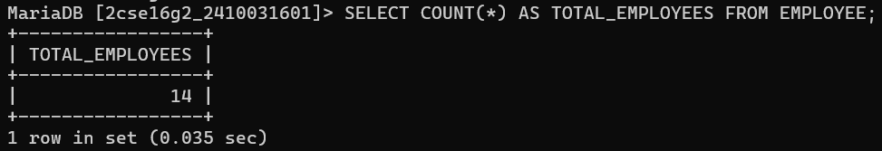

# question 2:- Display total salary paid to all employees
# query :-SELECT SUM(SAL) AS TOTAL_SALARY FROM EMPLOYEE;
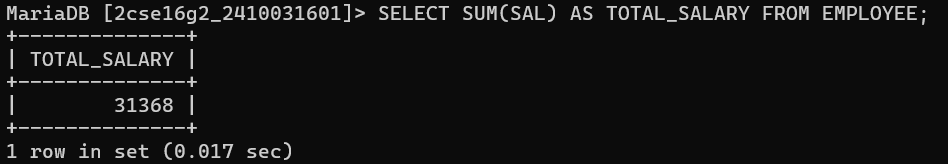

# question 3:- Display maximum salary
# query :-SELECT MAX(SAL) AS MAX_SALARY FROM EMPLOYEE;
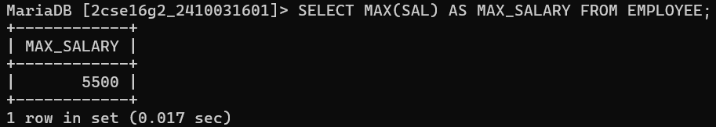

# question 4:-Display minimum salary
# query :-SELECT MIN(SAL) AS MIN_SALARY FROM EMPLOYEE;
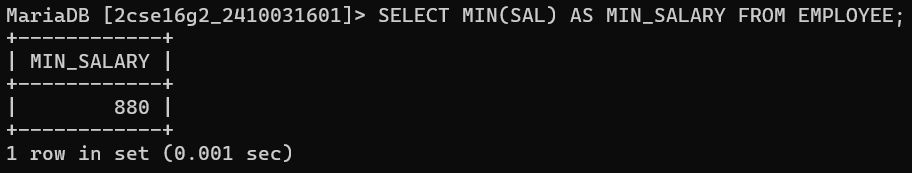

# question 5:-Display average salary
# query :-SELECT AVG(SAL) AS AVG_SALARY FROM EMPLOYEE;
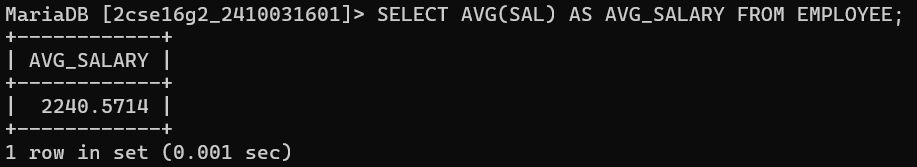

# question 6:-Display maximum salary of clerks
# query :-SELECT MAX(SAL) FROM EMPLOYEE WHERE JOB = 'CLERK';
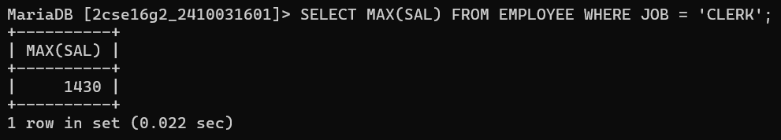

# question 7:-Display maximum salary in department 20
# query :-SELECT MAX(SAL) FROM EMPLOYEE WHERE DEPTNO = 20;
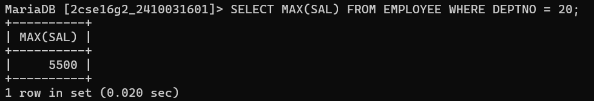

# question 8 :-Display minimum salary of salesman
# query :-SELECT MIN(SAL) FROM EMPLOYEE WHERE JOB = 'SALESMAN';
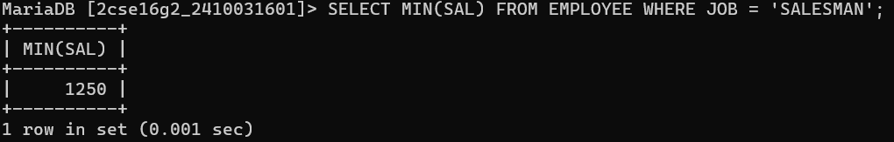

# question 9:-Display average salary of managers
# query :-SELECT AVG(SAL) FROM EMPLOYEE WHERE JOB = 'MANAGER';
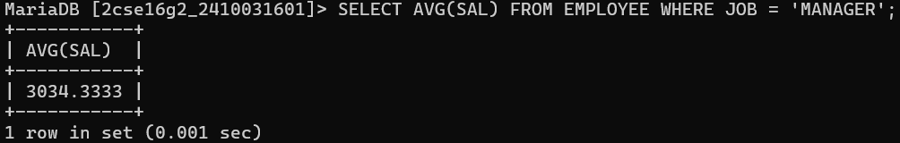

# question 10:-Display total salary of analysts in department 40
# query :-SELECT SUM(SAL) FROM EMPLOYEE WHERE JOB = 'ANALYST' AND DEPTNO = 40;
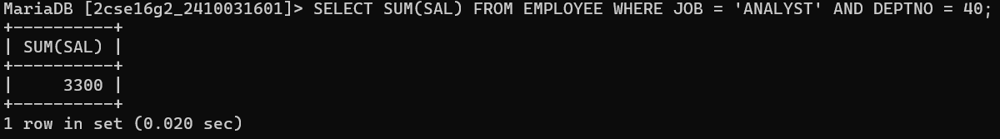

# question 11:-Display employee names in uppercase
# query :-SELECT UPPER(ENAME) FROM EMPLOYEE;
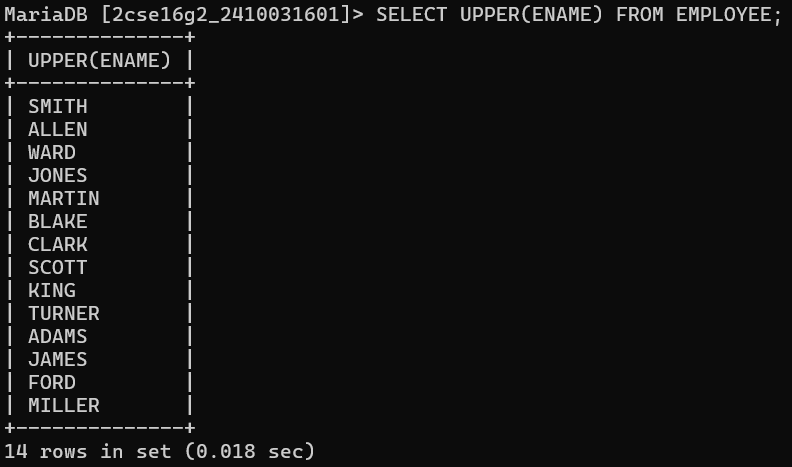

# question 12:-Display employee names in lowercase
# query :-SELECT LOWER(ENAME) FROM EMPLOYEE;
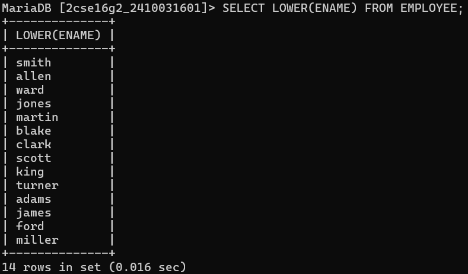

# question 13:-Display employee names in proper case
# query :-SELECT INITCAP(ENAME) FROM EMPLOYEE;

# question 14:-Display length of your name
# query :-SELECT LENGTH('RAJ') AS NAME_LENGTH FROM DUAL;
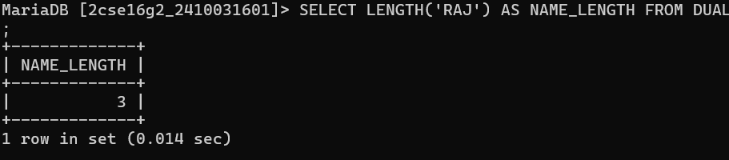

# question 15:-Display length of all employee names
# query :-SELECT ENAME, LENGTH(ENAME) FROM EMPLOYEE;
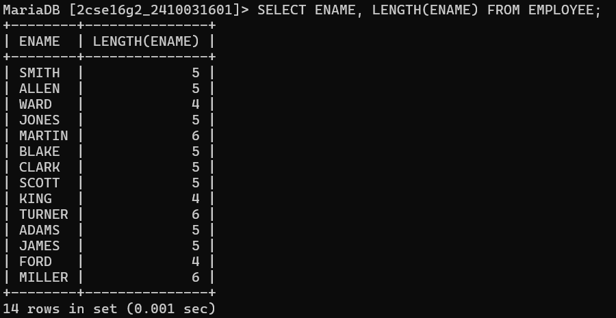
