# question 1:-Display empno, ename, deptno from employee table. Instead of display department numbers display the related department name (Use decode function).
# query - SELECT EMPNO, ENAME, CASE WHEN DEPTNO = 10 THEN 'RESEARCH' WHEN DEPTNO = 20 THEN 'ACCOUNTING' WHEN DEPTNO = 30 THEN 'SALES' WHEN DEPTNO = 40 THEN 'OPERATIONS' ELSE 'UNKNOWN' END AS DNAME FROM EMPLOYEE;
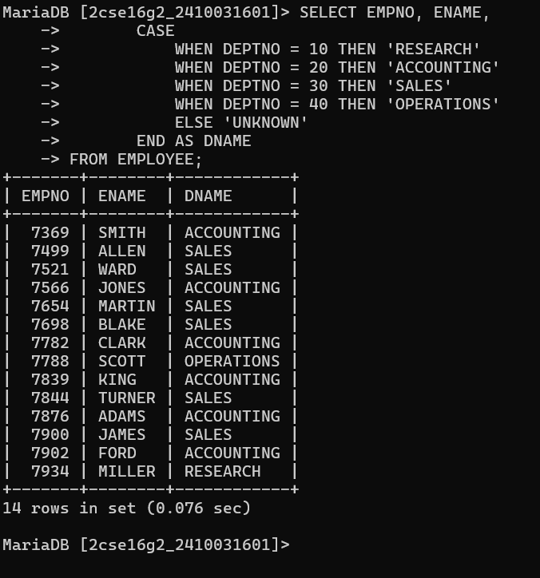

# question 2:-Display your age in days.
# query - SELECT DATEDIFF(CURDATE(), '2000-01-01') AS AGE_DAYS;
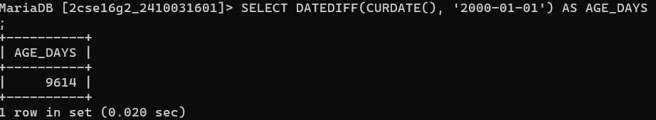

# question 3:-Display your age in months. 1,2
# query - SELECT TIMESTAMPDIFF(MONTH, '2000-01-01', CURDATE()) AS AGE_MONTHS;
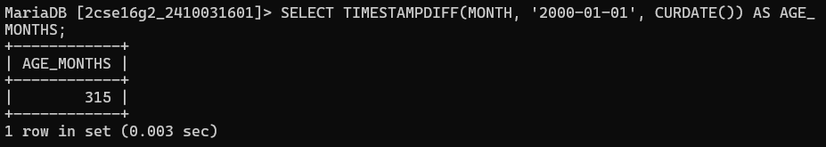

# question 4:-Display the current date as 15th August Friday Nineteen Ninety-Seven.
# query - SELECT DATE_FORMAT(CURDATE(), '%D %M %W %Y') AS FORMATTED_DATE;
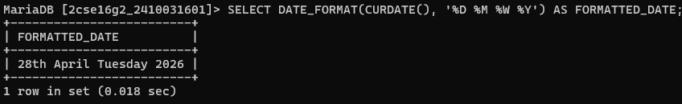

# question 5:-Display the following output for each row from employee table.
# query - SELECT CONCAT(ENAME, ' has joined the company on ', DATE_FORMAT(HIREDATE, '%W %D %M %Y')) AS INFO FROM EMPLOYEE;
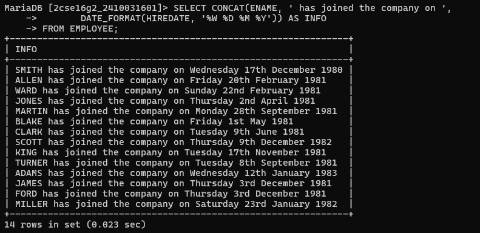

# question 6:-Scott has joined the company on Wednesday 13th August Nineteen Ninety
# query - SELECT CONCAT('Scott has joined the company on ', DATE_FORMAT(HIREDATE, '%W %D %M %Y')) FROM EMPLOYEE WHERE ENAME = 'SCOTT';
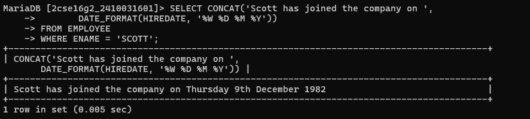

# question 7:-Find the date for nearest Saturday after current date.
# query -SELECT DATE_ADD(CURDATE(), INTERVAL (7 - DAYOFWEEK(CURDATE())) % 7 DAY) AS NEXT_SATURDAY;
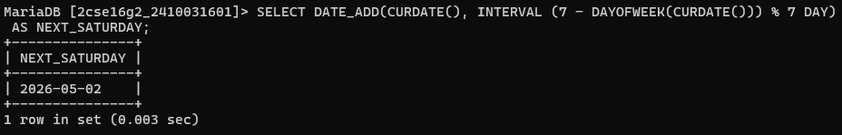

# question 8:-Display current time.
# query -SELECT CURTIME() AS TIME_NOW;
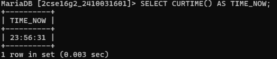

# question 9:-Display the date three months Before the current date
# query -SELECT DATE_SUB(CURDATE(), INTERVAL 3 MONTH) AS THREE_MONTHS_BEFORE;
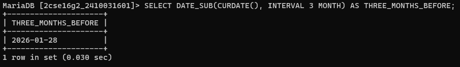

# question 10:-Display those employees who joined in the company in the month of Dec.
# query - SELECT * FROM EMPLOYEE WHERE MONTH(HIREDATE) = 12;
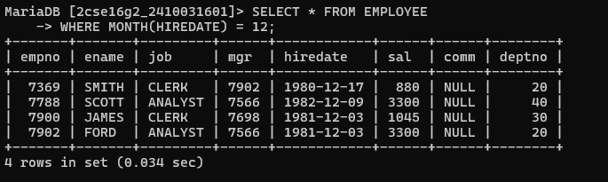

# question 11:-Display those employees whose first 2 characters from hire date -last 2 characters of salary.
# query -SELECT ENAME, CONCAT(LEFT(DATE_FORMAT(HIREDATE,'%d%m%y'),2), RIGHT(SAL,2)) AS RESULT FROM EMPLOYEE;
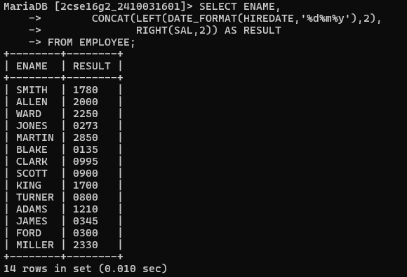

# question 12:-Display those employees whose 10% of salary is equal to the year of joining.
# query -SELECT * FROM EMPLOYEE WHERE (SAL * 0.10) = RIGHT(YEAR(HIREDATE),2);
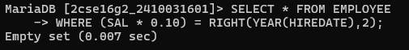

# question 13:-Display those employees who joined the company before 15 of the months.
# query -SELECT * FROM EMPLOYEE WHERE DAY(HIREDATE) < 15;
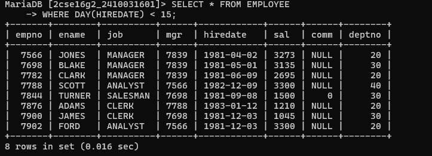

# question 14:-Display those employees who has joined before 15th of the month
# query -SELECT * FROM EMPLOYEE WHERE DAY(HIREDATE) < 15;
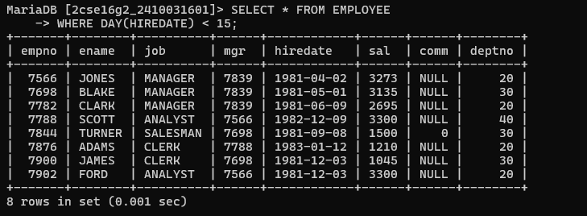

# question 15:-Display those employees whose joining DATE is available in deptno
# query - SELECT * FROM EMPLOYEE WHERE DAY(HIREDATE) = DEPTNO;
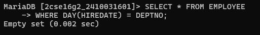