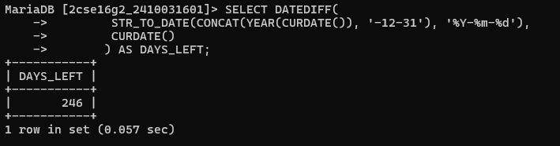
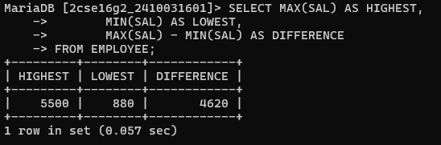
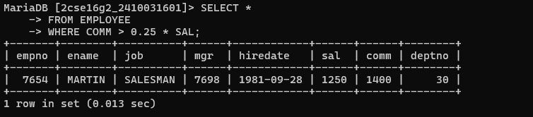
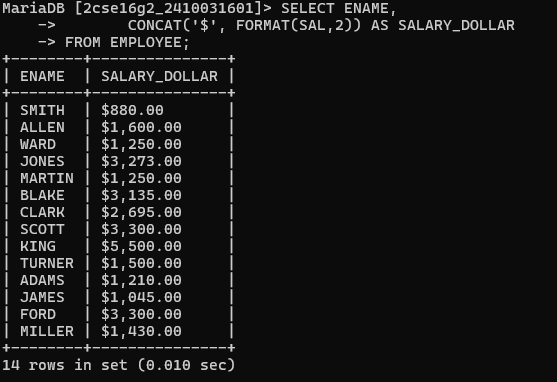
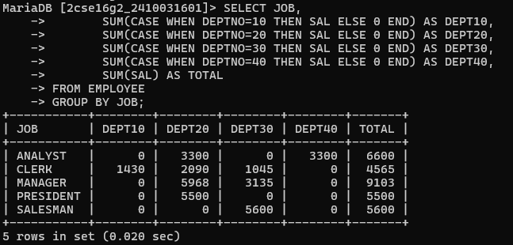
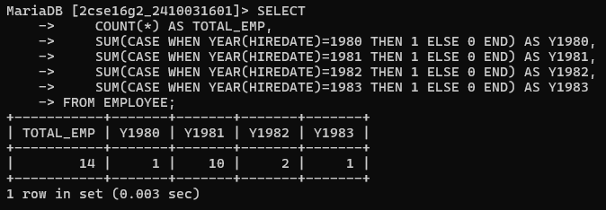
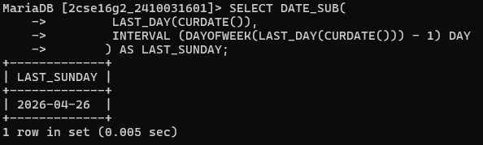
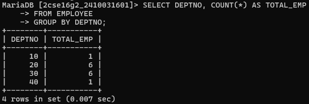
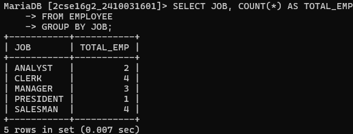
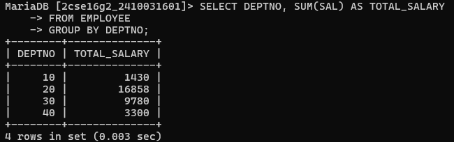

# question 1. Compute the no. of days remaining in this year.
# query :-SELECT DATEDIFF( STR_TO_DATE(CONCAT(YEAR(CURDATE()), '-12-31'), '%Y-%m-%d'), CURDATE() ) AS DAYS_LEFT;

# question 2. Find the highest and lowest salaries and the difference between of them.
# query :-SELECT MAX(SAL) AS HIGHEST,MIN(SAL) AS LOWEST, MAX(SAL) - MIN(SAL) AS DIFFERENCE FROM EMPLOYEE;

# question 3. List employee whose commission is greater than 25 % of their salaries. 
# query :-SELECT * FROM EMPLOYEE WHERE COMM > 0.25 * SAL;

# question 4. Make a query that displays salary in dollar format. 
# query :-SELECT ENAME, CONCAT('$', FORMAT(SAL,2)) AS SALARY_DOLLAR FROM EMPLOYEE;

# question 5. Create a matrix query to display the job, the salary for that job based on department number, and the total salary for that job for all departments, giving each column an appropriate heading. 
# query :-SELECT JOB, SUM(CASE WHEN DEPTNO=20 THEN SAL ELSE 0 END) AS DEPT20, SUM(CASE WHEN DEPTNO=30 THEN SAL ELSE 0 END) AS DEPT30, SUM(CASE WHEN DEPTNO=40 THEN SAL ELSE 0 END) AS DEPT40, SUM(SAL) AS TOTAL FROM EMPLOYEE GROUP BY JOB;

# question 6. Query that will display the total no of employees, and of that total the number who were hired in 1980,1981,1982 and 1983. Give appropriate column heading. 
# query :-SELECT COUNT(*) AS TOTAL_EMP, SUM(CASE WHEN YEAR(HIREDATE)=1980 THEN 1 ELSE 0 END) AS Y1980, SUM(CASE WHEN YEAR(HIREDATE)=1981 THEN 1 ELSE 0 END) AS Y1981, SUM(CASE WHEN YEAR(HIREDATE)=1982 THEN 1 ELSE 0 END) AS Y1982, SUM(CASE WHEN YEAR(HIREDATE)=1983 THEN 1 ELSE 0 END) AS Y1983 FROM EMPLOYEE;

# question 7. Query to get the last Sunday of Any Month. 
# query :-SELECT DATE_SUB( LAST_DAY(CURDATE()), INTERVAL (DAYOFWEEK(LAST_DAY(CURDATE())) - 1) DAY ) AS LAST_SUNDAY;

# question 8. Display department numbers and total number of employees working in each department. 
# query :-SELECT DEPTNO, COUNT(*) AS TOTAL_EMP FROM EMPLOYEE GROUP BY DEPTNO;

# question 9. Display the various jobs and total number of employees within each job group. 
# query :-SELECT JOB, COUNT(*) AS TOTAL_EMP FROM EMPLOYEE GROUP BY JOB;

# question 10. Display the depart numbers and total salary for each department. 
# query :-SELECT DEPTNO, SUM(SAL) AS TOTAL_SALARY FROM EMPLOYEE GROUP BY DEPTNO;
