# question 1. Display all employees with their dept name. 
# query :-SELECT E.ENAME, D.DNAME FROM EMPLOYEE E JOIN DEPARTMENT D ON E.DEPTNO = D.DEPTNO;
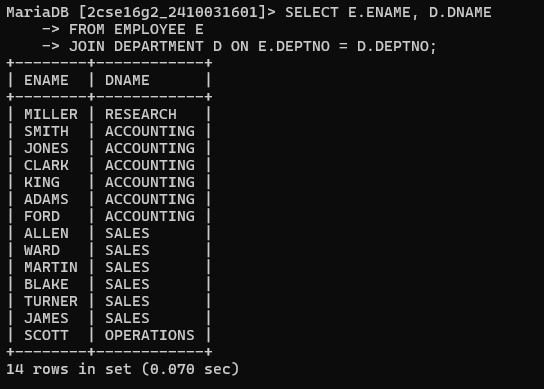

# question 2. Display those employees whose manager names is jones, and also display their manager name. 
# query :-SELECT E.ENAME AS EMPLOYEE,M.ENAME AS MANAGER FROM EMPLOYEE E JOIN EMPLOYEE M ON E.MGR = M.EMPNO WHERE M.ENAME = 'JONES';
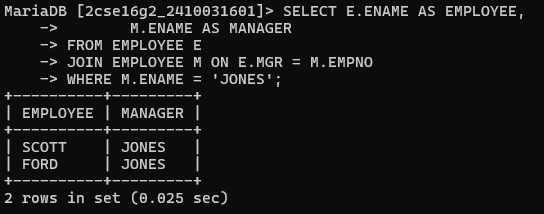

# question 3. Display employee name, his job, his dept name, his manager name, his grade and make out of an under department wise. 
# query :-SELECT E.ENAME, E.JOB, D.DNAME, M.ENAME AS MANAGER FROM EMPLOYEE E JOIN DEPARTMENT D ON E.DEPTNO = D.DEPTNO LEFT JOIN EMPLOYEE M ON E.MGR = M.EMPNO ORDER BY D.DNAME;
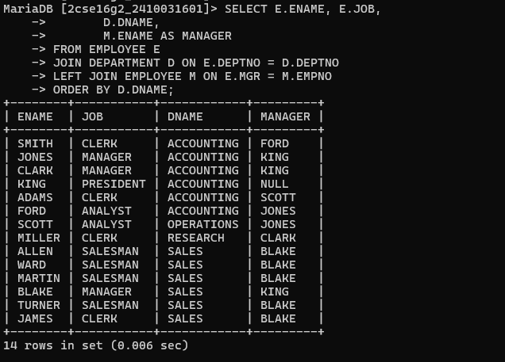

# question 4. List out all the employees name, job, and salary grade and department name for everyone in the company except ‘clerk’. Sort on salary display the highest salary. 
# query :-SELECT E.ENAME, E.JOB, D.DNAME FROM EMPLOYEE E JOIN DEPARTMENT D ON E.DEPTNO = D.DEPTNO WHERE E.JOB <> 'CLERK' ORDER BY E.SAL DESC;
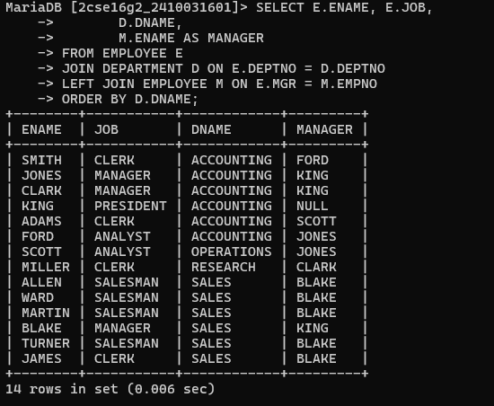

# question 5. Display employee name, his job and his manager. Display also employees who are without manager. 
# query :-SELECT E.ENAME, E.JOB, IFNULL(M.ENAME,'NO MANAGER') AS MANAGER FROM EMPLOYEE E LEFT JOIN EMPLOYEE M ON E.MGR=M.EMPNO;
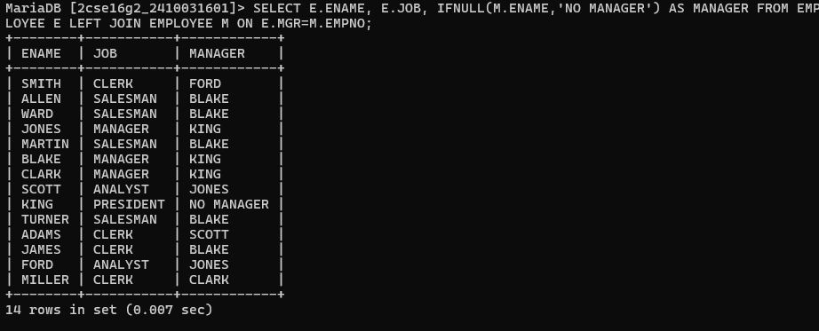

# question 6. List the employee name, job, annual salary, deptno, dept name and grade who earn 36000 a year or who are not clerks. 
# query :-SELECT E.ENAME, E.JOB, (E.SAL*12) AS ANNUAL_SAL, E.DEPTNO, D.DNAME FROM EMPLOYEE E JOIN DEPARTMENT D ON E.DEPTNO=D.DEPTNO WHERE (E.SAL*12)>=36000 OR E.JOB<>'CLERK';
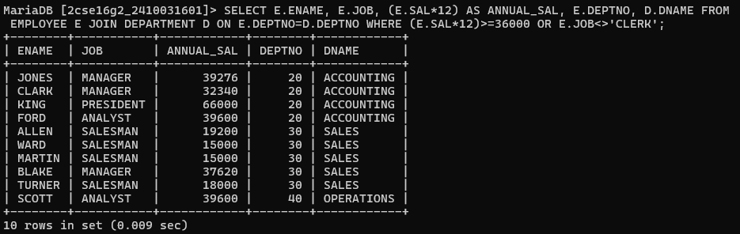

# question 7. List ename, job, annual sal, deptno, dname and grade who earn 30000 per year and who are not clerks. 
# query :-SELECT E.ENAME, E.JOB, (E.SAL*12) AS ANNUAL_SAL, E.DEPTNO, D.DNAME FROM EMPLOYEE E JOIN DEPARTMENT D ON E.DEPTNO=D.DEPTNO WHERE (E.SAL*12)>=30000 AND E.JOB<>'CLERK';
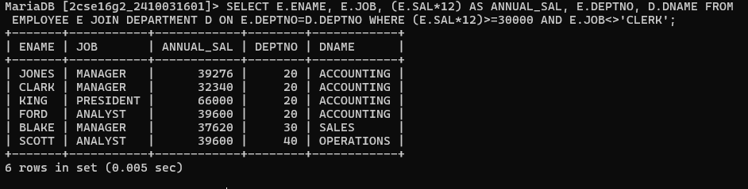

# question 8. List out all employees by name and number along with their manager’s name and number also display ‘no manager’ who has no manager. 
# query :-SELECT E.EMPNO, E.ENAME, IFNULL(M.EMPNO,'NONE') AS MGR_NO, IFNULL(M.ENAME,'NO MANAGER') AS MANAGER FROM EMPLOYEE E LEFT JOIN EMPLOYEE M ON E.MGR=M.EMPNO;
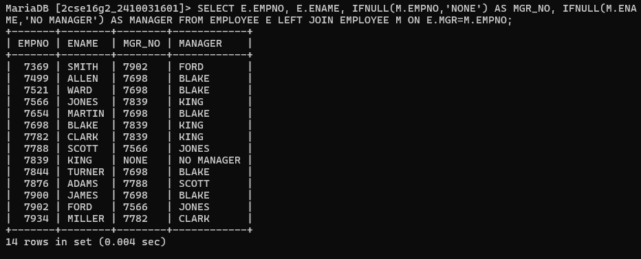

# question 9. Select dept name, dept no and sum of sal 
# query :-SELECT D.DEPTNO, D.DNAME, SUM(E.SAL) AS TOTAL_SAL FROM EMPLOYEE E JOIN DEPARTMENT D ON E.DEPTNO=D.DEPTNO GROUP BY D.DEPTNO,D.DNAME;
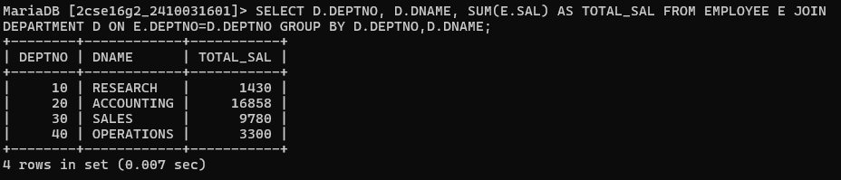

# question 10. Display employee number, name and location of the department in which he is working 
# query :-SELECT E.ENAME, D.DNAME FROM EMPLOYEE E JOIN DEPARTMENT D ON E.DEPTNO=D.DEPTNO;
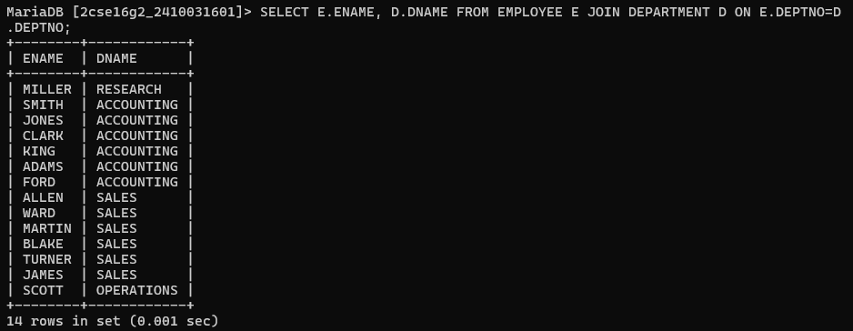

# question 11. Display employee name and department name for each employee. 
# query :-SELECT E.EMPNO, E.ENAME, D.DNAME FROM EMPLOYEE E JOIN DEPARTMENT D ON E.DEPTNO=D.DEPTNO;
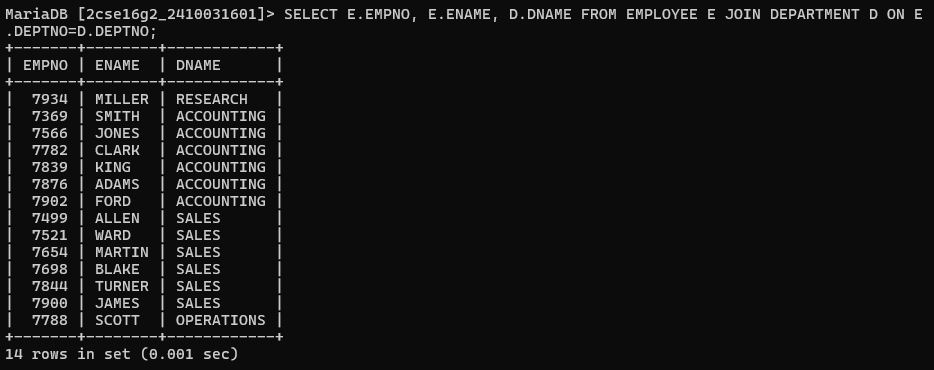