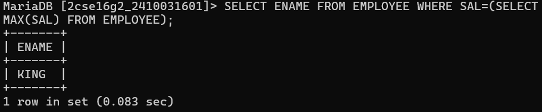
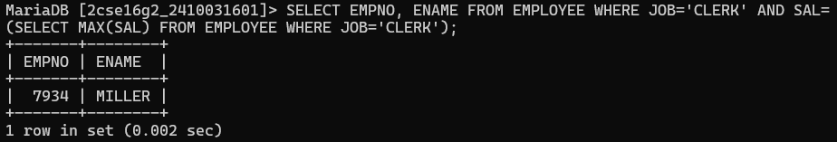
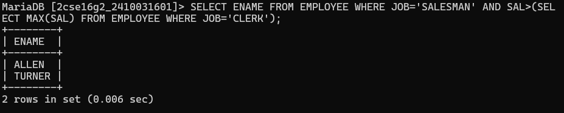
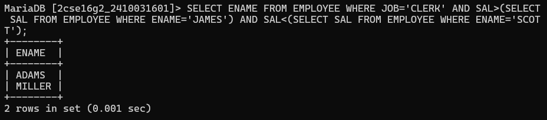
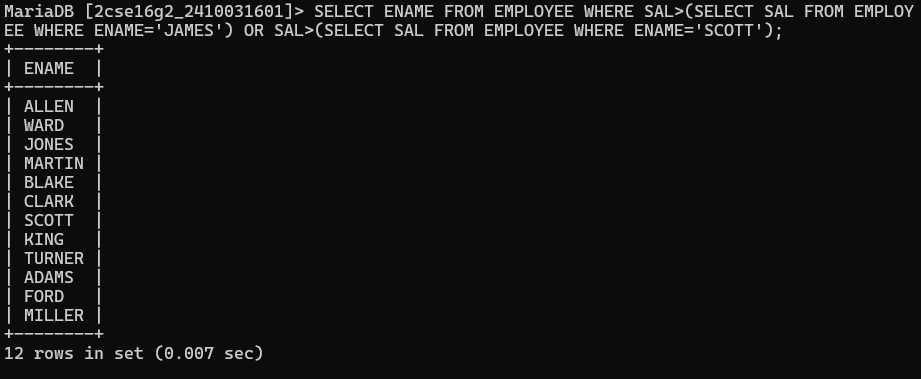
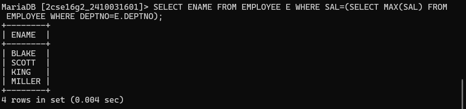
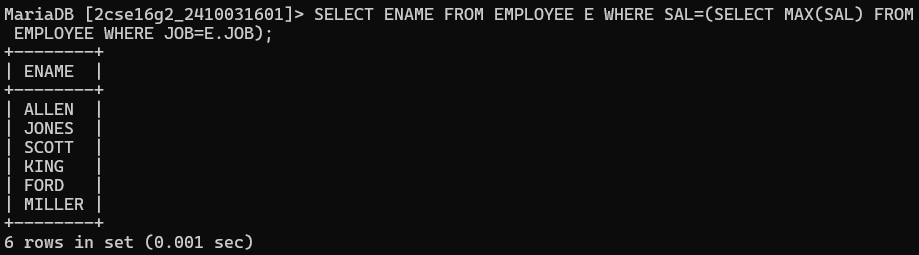
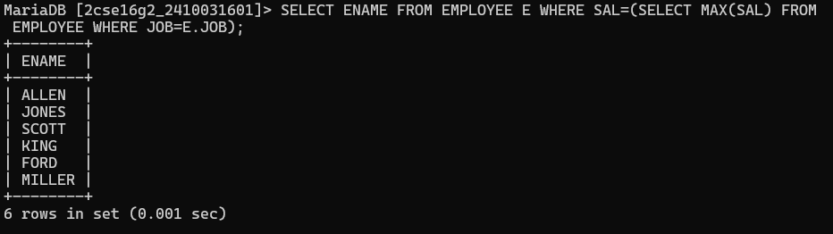
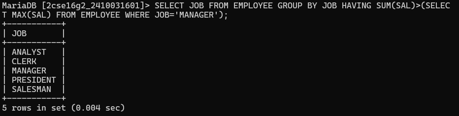

# question 1. Display the name of emp name who earns highest salary. 
# quesry :-SELECT ENAME FROM EMPLOYEE WHERE SAL=(SELECT MAX(SAL) FROM EMPLOYEE);

# question 2. Display the employee number and name of employee working  as clerk and earning highest salary among clerks. 
# quesry :-SELECT EMPNO, ENAME FROM EMPLOYEE WHERE JOB='CLERK' AND SAL=(SELECT MAX(SAL) FROM EMPLOYEE WHERE JOB='CLERK');

# question 3. Display the names of the salesman who earns a salary more  than the highest salary of any clerk.
# quesry :-SELECT ENAME FROM EMPLOYEE WHERE JOB='SALESMAN' AND SAL>(SELECT MAX(SAL) FROM EMPLOYEE WHERE JOB='CLERK');

# question 4. Display the names of clerks who earn salary more than that of james of that of sal lesser than that of scott 
# quesry :-SELECT ENAME FROM EMPLOYEE WHERE JOB='CLERK' AND SAL>(SELECT SAL FROM EMPLOYEE WHERE ENAME='JAMES') AND SAL<(SELECT SAL FROM EMPLOYEE WHERE ENAME='SCOTT');

# question 5. Display the names of employees who earn a sal more than that of james or that of salary greater than that of scott. 
# quesry :-SELECT ENAME FROM EMPLOYEE WHERE SAL>(SELECT SAL FROM EMPLOYEE WHERE ENAME='JAMES') OR SAL>(SELECT SAL FROM EMPLOYEE WHERE ENAME='SCOTT');

# question 6. Display the names of the employees who earn highest salary in their respective departments.
# quesry :-SELECT ENAME FROM EMPLOYEE E WHERE SAL=(SELECT MAX(SAL) FROM EMPLOYEE WHERE DEPTNO=E.DEPTNO);

# question 7. Display the names of employees who earn highest salaries in their respective job groups.
# quesry :-SELECT ENAME FROM EMPLOYEE E WHERE SAL=(SELECT MAX(SAL) FROM EMPLOYEE WHERE JOB=E.JOB);

# question 8. Display the employee names who are working in accounting dept. 
# quesry :-SELECT ENAME FROM EMPLOYEE E WHERE SAL=(SELECT MAX(SAL) FROM EMPLOYEE WHERE JOB=E.JOB);

# question 9. Display the employee names who are working in chicago.
# quesry :-SELECT ENAME FROM EMPLOYEE WHERE DEPTNO=(SELECT DEPTNO FROM DEPARTMENT WHERE DNAME='CHICAGO');

# question 10. Display the job groups having total salary greater than the maximum salary for managers. 
# quesry :-SELECT JOB FROM EMPLOYEE GROUP BY JOB HAVING SUM(SAL)>(SELECT MAX(SAL) FROM EMPLOYEE WHERE JOB='MANAGER');
